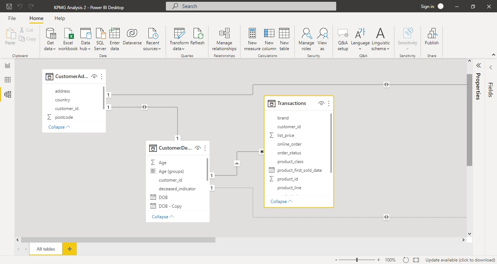

# Sprocket Target Marketing Analysis

## Introduction
Sprocket Central Pty Ltd, a medium size bikes and cycling accessories organization in Australia wants to optimize resource allocation for targeted marketing, boost business by analyzing their existing customer dataset to determine customer trends and behaviour and also note new customers to be targeted to drive the most value for the organization 
The client provided three datasets:
- Customer demographics
- Customer Address
- Transactions data in the past three months

## Questions About Business Insights

1. What are the trends in the underlying data?
2. Which customer segment has the highest customer value?
3. What do you propose should be Sprocket Central Pty Ltd?
4. What additional external datasets may be useful to obtain greater insights into customer preferences and propensity to purchase the products?

## Skills/ Concepts Demonstrated

The following PowerBI features were incorporated:
- Data Cleaning
- Range of attractive visualizations 
- Get data feature 
- Datasets filtration 
- Data Analysis Expressions DAX
- Page navigation
- Modelling
- Tooltips 
- Buttons

## Data Assessment

Below, I attached two tables showing the summary statistics and summary issues from the three datasets provided.

Dataset Name                |    Number of Records            |       Distinct Customer IDs
:--------------------------:|:-------------------------------:|:-------------------------------:
Customer Demographic        |    4,000                        |       4,000
Customer Address            |    3,999                        |       3,999
Transaction Data            |    20,000                       |       20,000
        

                            |    Customer Demographics        |       Customer address         |   Transactions 
:--------------------------:|:-------------------------------:|:-------------------------------:-------------------:
Accuracy                    |    DOB column inaccurate        |                                |
Completeness                |    Empty fields found in the following columns: last_name, DOB, Job_title and tenure|               |Empty fields found in the following columns:online_order, brand, product_line, product_class, product_size, standard_cost and product_first_sold_date
Consistency                 |  Inconsistent gender column                      |      Inconsistent states column     |
Currency                    |   Deceased customers be filtered out             |                                     |
Relevancy                   |   default column should be removed               |                                     |
Validity                    |                                                  |       Some columns not in their proper data type  |   Product_first_sold_date column not in the proper format

Having reviewed the datasets provided, Notable data quality issues that were encountered and the methods used to mitigate the identified data inconsistencies are as follows:

Additional customer_ids in the Transactions table and Customer address table but not in Customer Demographic table.
Mitigation:  Only customers in the Customer Demographic table were used as a training set for the model.
This indicates that the data received may not be in sync with each other which may skew the analysis results if there are missing data records.

Various columns, such as the brand of a purchase, or job title, have empty values in certain records
For key datasets, such as transactions, less than 1% of transactions have missing fields. These records have been removed from the training dataset.

Inconsistent values for the same attribute
(e.g Female being represented as “F”, “Femal” and ‘Female”)
Mitigation: regular expression were used to replace extended values into abbreviations to ensure consistency.

Inconsistent data type for the same attribute
(e.g. numeric values for some fields and strings for others)
Mitigation: selected records were converted in characters to numeric. 

## Data Modelling

Tables were linked using the customer_id column with a one to many relationship 

## Data Visualization

